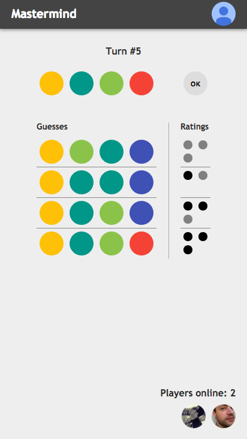

# Mastermind

==================

> [Mastermind (board game)](https://en.wikipedia.org/wiki/Mastermind_(board_game)) with all the cool stuff packed in, namingly [`redux-saga`](https://github.com/yelouafi/redux-saga), [`normalizr`](https://github.com/paularmstrong/normalizr), [`reselect`](https://github.com/reactjs/reselect) and [`react-router`](https://github.com/ReactTraining/react-router).

This is a JavaScript implementation of popular boardgame Mastermind. The project is based on generated template by [create-react-app](https://github.com/facebookincubator/create-react-app). It's using Firebase as a Backend. 

[Check it out on Heroku](https://mastermind-dev.herokuapp.com)

## Development

1. Clone local copy of the repository.
2. Install all the dependencies `npm install`
3. Run the app via `npm start`
4. Open your browser `open http://localhost:3000`
